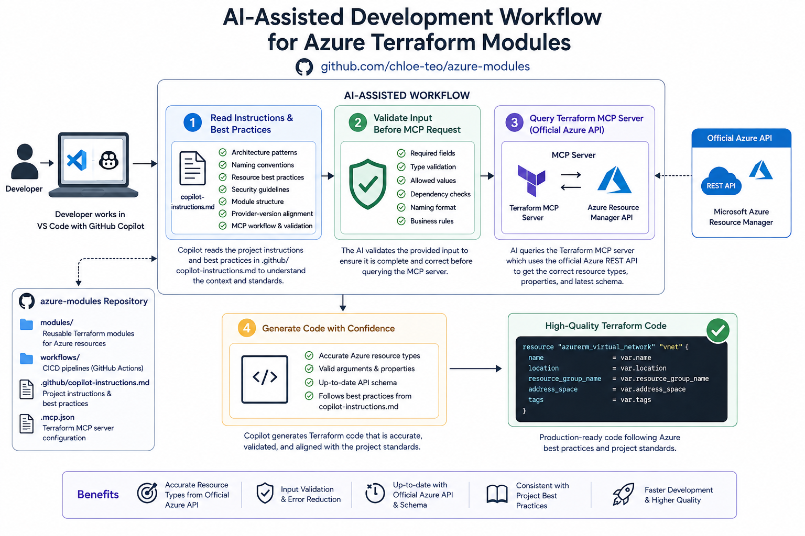

# Azure Terraform Modules

Reusable Terraform modules for provisioning Azure infrastructure components.

## Modules

| Module | Purpose |
|--------|---------|
| `azure-resource-group` | Create Azure resource groups |
| `azure-virtual-network` | VNet with configurable subnets |
| `azure-kubernetes-service` | AKS cluster deployment |
| `azure-container-registry` | Container image registry |
| `azure-service-plan` | App Service Plan (for Functions, Web Apps) |
| `azure-function-app` | Serverless function deployments |
| `azure-storage-account` | Blob storage, Terraform state backend |
| `azure-application-insight` | Application monitoring & logging |
| `azure-key-vault` | Azure Key Vault for secrets and keys |
| `azure-private-dns-zone` | Private DNS zone management |
| `azure-private-endpoint` | Private endpoint connectivity |
| `azure-role-assignment` | Azure RBAC role assignments |

## Module Structure

Each module includes:
```
module-name/
├── main.tf          # Resource definitions
├── variables.tf     # Input variables
├── outputs.tf       # Output values
└── providers.tf     # Required providers (if module-level config needed)
```

## AI-Assisted Development



The repository includes [`.github/copilot-instructions.md`](../.github/copilot-instructions.md) to provide AI coding assistants with local Terraform conventions and workflow requirements. These instructions ground suggestions in the repository's provider versions, module structure, validation steps, and security practices, helping make local AI-assisted development more reliable and reducing unsupported assumptions or hallucinated configuration.

## Usage

### Terraform

Reference a module from a standard Terraform root module with a local path:

```hcl
module "aks" {
  source = "../azure-modules/azure-kubernetes-service"

  cluster_name   = var.cluster_name
  resource_group = var.resource_group
  location       = var.location
  node_count     = var.node_count
}
```

Initialize and run the Terraform project from its root directory:

```powershell
terraform init
terraform validate
terraform plan -var-file="dev.tfvars"
terraform apply -var-file="dev.tfvars"
```

For an Azure Storage backend, provide the backend settings during initialization:

```powershell
terraform init `
  -backend-config="resource_group_name=rg-dev" `
  -backend-config="storage_account_name=stdevstinfra" `
  -backend-config="container_name=tfstate" `
  -backend-config="key=dev/my-project/terraform.tfstate"
```

### Terragrunt

Reference modules in Terragrunt configurations:

```hcl
terraform {
  source = "${find_in_parent_folders("azure-modules")}/azure-kubernetes-service"
}

inputs = {
  cluster_name       = "aks-dev-cluster"
  resource_group     = "rg-dev"
  location           = "Sweden Central"
  node_count         = 2
}
```

## Best Practices

- Each module manages a single resource type
- Variables are explicitly defined in `variables.tf`
- Outputs are exported in `outputs.tf` for cross-module dependencies
- Modules are environment-agnostic (values provided by the root Terraform module or Terragrunt)
